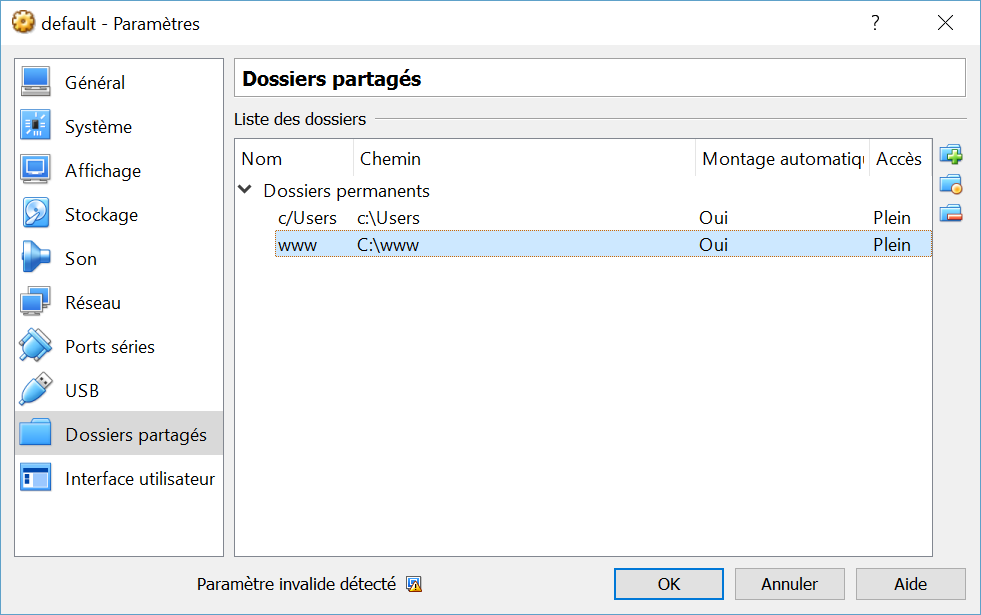

# ZSH-NodeJS
Node-Development container.

This Node-Development environment is a ZSH shell with Yeoman, Bower, Gulp, Grunt-cli, Angular-cli.

Ports exposed:
- **8000** : for Node server

## Installation
ZSH-NodeJS require docker.

First, run your docker terminal.

Then you will need to clone this repo :

```sh
$ git clone git@github.com:stayfi/zsh-nodejs.git
$ cd zsh-nodejs
```

You have to add shared folders to your docker virtual machine, in Oracle VM Virtual Box :

- shared vm name "**www**" -> To your "www" root



You have to add the "`bootlocal.sh`" file to your virtual machine in this folder "`/var/lib/boot2docker/`" :

```sh
$ docker-machine ssh default
* "(assuming 'default' is your docker virtual machine name)"
$ sudo vi /var/lib/boot2docker/bootlocal.sh
* "paste those lines into this new file:"
mkdir -p /home/docker/zsh-nodejs/www
mount -t vboxsf www /home/docker/zsh-nodejs/www

$ sudo chmod +x /var/lib/boot2docker/bootlocal.sh
```

Restart your docker machine (assuming "default" is your docker virtual machine name):
```sh
$ docker-machine restart default
```

Build zsh-nodejs container :
```sh
$ docker build -t stayfi/zsh-nodejs zsh-nodejs
```

## Usage

Run zsh-nodejs by :
```sh
$ docker run -ti -p 8000:8000 -v /home/docker/zsh-nodejs/www:/var/www stayfi/zsh-nodejs /bin/zsh
```

You will have your zsh prompt.

#### Yeoman

```sh
$ yo --version
```

#### Angular cli

```sh
$ ng --version
```

#### Bower

```sh
$ bower --version
```

#### Gulp

```sh
$ gulp --version
```

#### Grunt cli

```sh
$ grunt --version
```

## Credits
Stayfi B. - <stayfi@gmail.com>

## Versions
(Major.Minor[.Fix])

#### 1.0
First version, working.

## License
MIT license